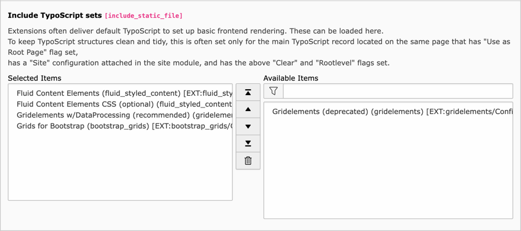
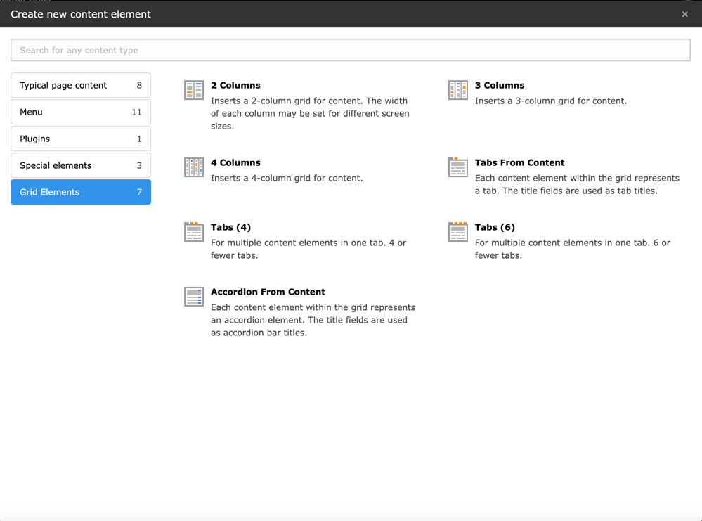
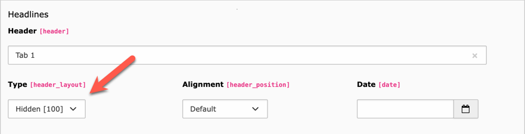
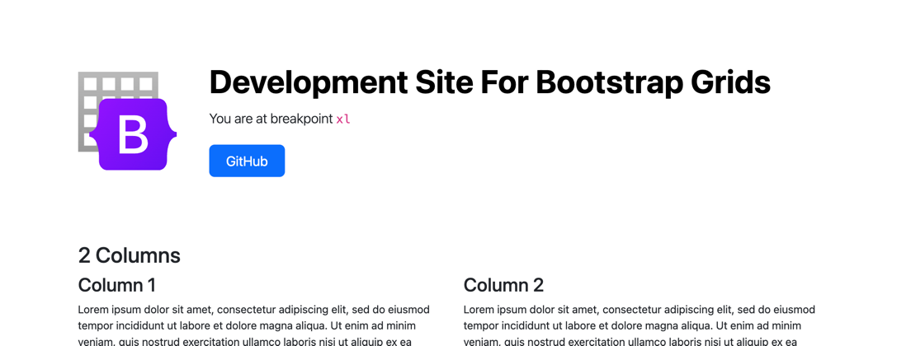

# TYPO3 extension "bootstrap_grids"

> Thanks to @doemedia and @prdt3e for their support on compatibility to TYPO3 v13. <3

Predefined `gridelements` Bootstrap 5 content elements: column grids, grids for simple accordions, and tabs.

## Installation

1. Install the extension via composer: `composer require laxap/bootstrap-grids`. If `gridelements` is not installed, it will be installed automatically since it's a requirement.
2. Include the [static TypoScript templates](Documentation/Images/IncludeStatic.png). Both `bootstrap_grids` and `gridelements` templates are required (the order of templates is important).



_NOTE: PHP is capped at 8.4 for now. `gridelements` 13 declares `~8.2 || ~8.3 || ~8.4`, and this extension still supports TYPO3 12, whose Composer constraint is `^8.1` (no 8.5). CI skips PHP 8.4 × TYPO3 12 because `gridelements` 12 does not declare PHP 8.4._

## Usage

Use one of the [predefined grids](Documentation/Images/Screenshot.png) on your website.



_NOTE: When using "Tabs From Content Elements" and "Accordion From Content", you need to [set the header Type to Hidden](Documentation/Images/HeaderTypeHidden.png). If you don't then the accordion/tab title will also display as a heading tag in the content area._



## Updating to `bootstrap_grids` v5

The paths of TypoScript files have changed. Please ensure you reselect the template in your `sys_template` record.

## Contribution

We would love your help! We have Docker set up with helper scripts to make contributions easy.



### Development setup

1. Install [Docker](https://www.docker.com/).
2. Fork the [boostrap_grids repository](https://github.com/laxap/bootstrap_grids.git).
3. Clone the forked repository (e.g. `git clone https://github.com/your_username/bootstrap_grids.git`), change into the directory, then checkout a branch or create desired branch.
4. OPTIONAL: Do `cp -i .docker/.env.dist .docker/.env` before the next step if you need anything other than the defaults (TYPO3 13, PHP 8.4, HTTP_PORT 8080). Set `TYPO3=12` or `TYPO3=13`, `PHP=8.2`, `8.3`, or `8.4`, and `HTTP_PORT` for the host port. `TYPO3=` selects Docker templates and pins Composer to that core line. To switch TYPO3 version after a previous `.docker/bin/up`, run `.docker/bin/destroy` first. Otherwise `.docker/.env.dist` will automatically be copied to `.docker/.env` if it doesn't already exist and you can skip this step.
5. OPTIONAL: Start Xdebug if you need to debug PHP code.
6. Run `.docker/bin/up`. The container copies templates and installs Composer dependencies for the selected TYPO3 line. Wait until [http://localhost:8080/typo3](http://localhost:8080/typo3) responds (or `http://localhost:<HTTP_PORT>/typo3`).
   - If a dependency blocks your target PHP version temporarily, set `COMPOSER_IGNORE_PLATFORM_REQ=php` in `.docker/.env` before starting to run Composer with `--ignore-platform-req=php`.
7. Login with username `admin` and password `Pass123!`.

_NOTE: The `.docker/templates/[typo3-version-specified-in-.env]` directory is copied to the project root during `.docker/bin/up` (no-clobber, so existing files stay). From that point on you'll need to edit files in their new location to see live changes. Changing `TYPO3=` without `.docker/bin/destroy` first leaves the old `.htaccess` and site config in place. When you're done with the install, use `.docker/bin/destroy` for a full teardown (including generated/copied files), or clean up manually._

### Run tests locally

Unit tests do not boot TYPO3. Functional tests boot a SQLite TYPO3 instance.

```bash
composer install --no-scripts
composer test
composer test:functional
composer cs
composer cs:fix
```

`composer cs` is a dry-run. `composer cs:fix` rewrites PHP to TYPO3 coding standards (`typo3/coding-standards` / php-cs-fixer).

Needs PHP 8.2–8.4 with `intl` and `pdo_sqlite`. Inside Docker (after `.docker/bin/up`):

```bash
.docker/bin/composer test
.docker/bin/composer test:functional
```

To match GitHub’s PHP matrix locally, use [act](https://github.com/nektos/act) (below) or switch PHP with phpbrew/Homebrew and re-run the commands above. Changing `PHP=` in `.docker/.env` rebuilds the app image; that is only needed to run the TYPO3 site, not the test suites.

### Verify GitHub Actions test job locally

Before pushing, you can run the same `test` job locally with [act](https://github.com/nektos/act):

1. Install [Docker](https://www.docker.com/) and make sure Docker Desktop is running.
2. Install [act](https://github.com/nektos/act) to run [GitHub Actions](https://developer.github.com/actions/) locally (e.g. on macOS: `brew install act`).
3. Run

   ```bash
   act -j test --container-architecture linux/amd64
   ```

### Docker scripts

| Command                          | App must be up | Description                                                                                                                                                                                                                                                    |
| -------------------------------- | -------------- | -------------------------------------------------------------------------------------------------------------------------------------------------------------------------------------------------------------------------------------------------------------- |
| `.docker/bin/up`                 | ✗              | Runs `.docker/bin/compose up -d --build`. Container start copies templates and runs Composer for `TYPO3=`. Do not chain `.docker/bin/composer install` in parallel with that. |
| `.docker/bin/down`               | ✗              | Runs `.docker/bin/compose down --remove-orphans` to stop and remove containers and network.                                                                                                                                                                    |
| `.docker/bin/destroy`            | ✗              | Runs `.docker/bin/compose down --remove-orphans --volumes --rmi all`, then removes generated/copied project files.                                                                                                                                             |
| `.docker/bin/logs`               | ✗              | Runs `.docker/bin/compose logs -f`.                                                                                                                                                                                                                            |
| `.docker/bin/cli`                | ✓              | Runs `.docker/bin/compose exec app bash` to open shell in the app container.                                                                                                                                                                                   |
| `.docker/bin/composer [command]` | ✓              | Runs Composer in the app container. If `COMPOSER_IGNORE_PLATFORM_REQ` was set in `.docker/.env` when the container started, prepends `--ignore-platform-req=<value>`.                                                                                          |
| `.docker/bin/typo3 [command]`    | ✓              | Runs `.docker/bin/compose exec app vendor/bin/typo3 "$@"`.                                                                                                                                                                                                     |
| `.docker/bin/compose [command]`  | ✗              | Wrapper around Docker Compose used by all helper scripts: auto-creates `.docker/.env` from `.docker/.env.dist` when missing, exports vars, prints selected `TYPO3`/`PHP`/`HTTP_PORT`, then runs `docker compose -f .docker/docker-compose.base.yml [command]`. |

## Change log

- See the [release notes](https://github.com/RozbehSharahi/bootstrap_grids/releases).

## Special thanks

- [Daniel Corn](https://www.cundd.net): Defining the grids via pageTS brings a lot of advantages.
- [Josef Körner](https://www.brandical.de): For reducing the accordion TypoScript setup.
