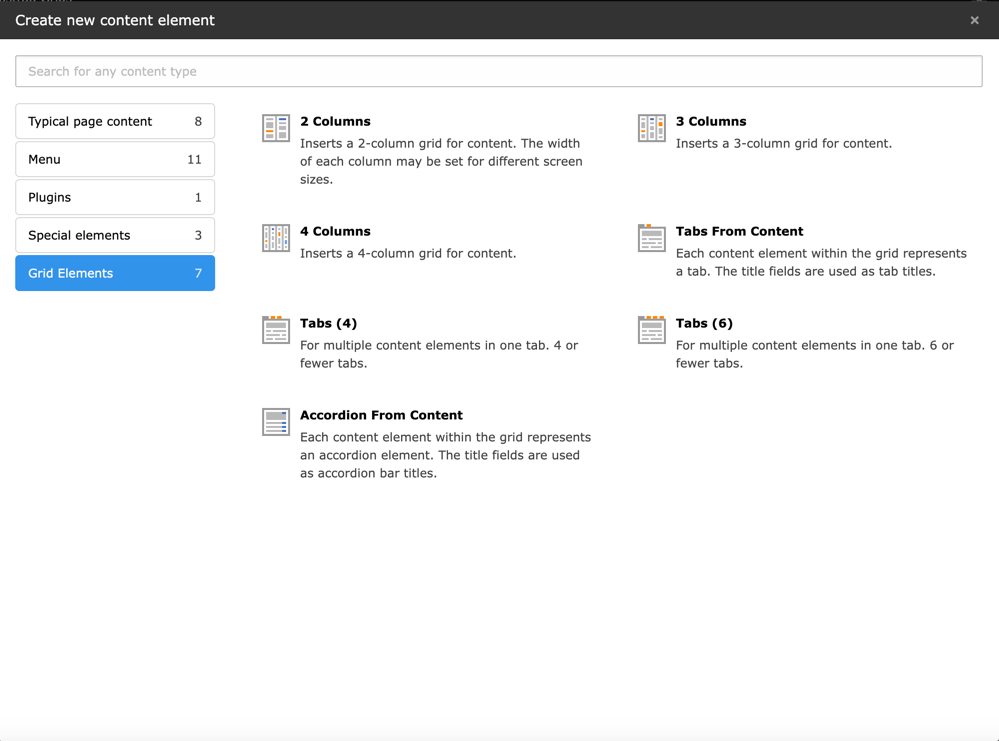

# TYPO3 extension "bootstrap_grids"

Predefined `gridelements` Bootstrap 5 content elements: column grids, grids for simple accordions, and tabs.

## Installation

1. Install the extension via composer: `composer require laxap/bootstrap-grids`. If `gridelements` is not installed, it will be installed automatically since it's a requirement.
2. Include the [static TypoScript templates](Documentation/Images/IncludeStatic.png). Both `bootstrap_grids` and `gridelements` templates are required (the order of templates is important).

_NOTE: As of 2025-03-03, `gridelements` v12 doesn't support PHP 8.4, but we have an issue open they are responding to fix that. So, we will preemptively support PHP 8.4 in anticipation of that fix._

## Usage

Use one of the [predefined grids](Documentation/Images/Screenshot.png) on your website.

_NOTE: When using "Tabs From Content Elements" and "Accordion From Content", you need to [set the header Type to Hidden](Documentation/Images/HeaderTypeHidden.png). If you don't then the accordion/tab title will also display as a heading tag in the content area._

## Updating to `bootstrap_grids` v5

The paths of TypoScript files have changed. Please ensure you reselect the template in your `sys_template` record.

## Contribution

We would love your help! We have Docker set up with helper scripts to make contributions easy.

### Development setup

1. Install [Docker](https://www.docker.com/).
2. Fork the [boostrap_grids repository](https://github.com/laxap/bootstrap_grids.git).
3. Clone the forked repository (e.g. `git clone https://github.com/your_username/bootstrap_grids.git`), change into the directory, then checkout a branch or create desired branch.
4. OPTIONAL: Do `cp -i .docker/.env.dist .docker/.env` before the next step if you need anything other than default versions of TYPO3/PHP. Otherwise `.docker/.env.dist` will automatically be copied to `.docker/.env` if it doesn't already exist and you can skip this step.
5. OPTIONAL: Start Xdebug if you need to debug PHP code.
6. Run `.docker/bin/start && .docker/bin/composer install`
7. Login to http://localhost:8080/typo3 with username `admin` and password `Pass123!`.

_NOTE: The `.docker/templates/[typo3-version-specified-in-.env]` directory is copied to the project root during `.docker/bin/start`, so from that point on you'll need to edit files in their new location to see live changes. When you're done with the install, you can delete the container and those copied files by doing `.docker/bin/clean` or by doing it manually._

### Docker scripts

| Command                                  | Description                                                                                                                                                                                                                  |
|------------------------------------------|------------------------------------------------------------------------------------------------------------------------------------------------------------------------------------------------------------------------------|
| `.docker/bin/start`                      | To start dev environment                                                                                                                                                                                                     |
| `.docker/bin/stop`                       | To stop dev environment                                                                                                                                                                                                      |
| `.docker/bin/clean`                      | Does `docker compose down --remove-orphans` and deletes generated/copied files (except `.docker/.env`) and resets the database to its initial state using the starting point in `.docker/templates/database/database.sqlite` |
| `.docker/bin/logs`                       | Runs `.docker/bin/compose logs -f`                                                                                                                                                                                           |
| `.docker/bin/cli`                        | Enter the dev environment container                                                                                                                                                                                          |
| `.docker/bin/composer [command]`         | Runs `composer` commands (e.g. `./docker/bin/composer install`)                                                                                                                                                              |
| `.docker/bin/typo3 [command]`            | Runs `vendor/bin/typo3` commands (e.g. `.docker/bin/typo3 cache:flush`)                                                                                                                                                      |
| `.docker/bin/compose [command]`          | Runs `docker compose` commands (e.g. `./docker/bin/compose up -d --build`)                                                                                                                                                   |

## Change log

### Version 5.0.0

- UPDATED: Switched to Bootstrap 5
- UPDATED: Enhanced Docker experience for easier development

### Version 3.0.0

- REMOVED: Optional row gridelement

### Version 2.0.0

- UPDATED: Switched to Bootstrap 4
- REMOVED: Slider grid element and flexslider script

### Version 1.3.0

- ADDED: 2-/3-/4-columns grid `itemProcFunc` for select items
- ADDED: Optional row gridelement

### Version 1.2.0

- ADDED: Backend, drag & drop support: default col-md-6/4/3 classes are used for the column divs in the frontend if a gridelement is dragged into the page without editing it.
- UPDATED: Changed from empty to a blank character for the 2-/3-/4-columns grid the `not set` option value of the desktop column classes (first tab).
- REMOVED: Optional support for old record based grid definitions removed
- REMOVED: Optional row gridelement

## Special thanks

- [Daniel Corn](https://www.cundd.net): Defining the grids via pageTS brings a lot of advantages.
- [Josef Körner](https://www.brandical.de): For reducing the accordion TypoScript setup.
